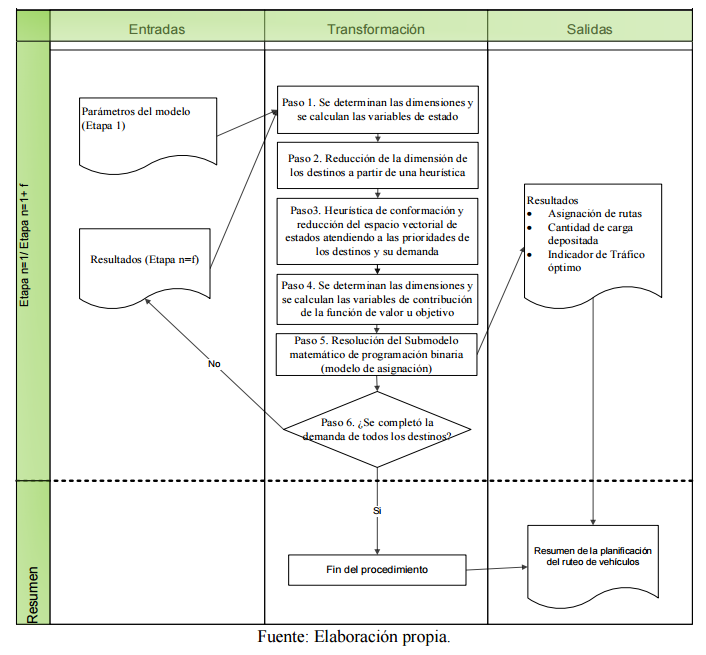

# Ruteo vehicular y manejo de inventario en una entidad comercializadora de combustibles mediante programación matemática

Este repositorio contiene una implementación en Python del modelo matemático propuesto en el artículo científico **"Modelo heurístico híbrido para el ruteo vehicular y manejo de inventario en una entidad comercializadora de combustibles"**. Este proyecto tiene como objetivo optimizar la planificación de la de combustibles por etapas en una situación dada en una entidad comercializadora de combustibles de Santiago de Cuba, maximizando en cada etapa el valor del indicador tráfico de mercancías (un ratio que al ser maximizado permite maximizar la cantidad de mercancía distribuida mientras se minimiza la distancia recorrida) mientras se cumplen restricciones impuestas por el entorno en el que se realiza la distribución.

## Contexto

En la cadena de suministros de combustibles de Santiago de Cuba, la planificación de la distribución logística enfrenta múltiples desafíos debido a limitaciones en la disponibilidad de vehículos, capacidades heterogéneas  y restringidas de los mismos y restricciones en la gestión de inventarios. Este proyecto es un ejemplo de implementacion del estudio original donde se desarrolla y aplica un modelo híbrido que combina heurísticas con modelos de programación entera binaria para abordar estos retos, permitiendo:

- Determinar el plan de distribución operativo que permita el cumplimiento de niveles de inventarios de acuerdo a un nivel de cobertura planificado.
- El uso racional de los vehículos.
  
> **Nota:** Aunque este modelo está basado en el artículo, los datos utilizados aquí son ficticios y no corresponden a los datos reales de la publicación. También se emplea gurobipy junto al solver de Gurobi, en vez de pyomo y el solver CBC como en la publicación original.

---

## Características del Proyecto

- **Modelo Matemático híbrido:** Implementación de un modelo que combina heurísticas con programación lineal entera binaria en Python utilizando la biblioteca `gurobipy`.
- **Soluciones Optimizadas por etapas:** Resolución de múltiples modelos por etapa con el solver Gurobi Optimizer version 12.0.0.

---

## Estructura del Repositorio

```
├── analysis.ipynb # Notebook con análisis detallado
├── results/
│   └── outputs/ # Resultados generados por el modelo
├── recursos/ # Módulo Python que contiene las clases, métodos y funciones necesarias para implmentar el modelo matemático
│   └── clases.py/ # Contiene las clases necesarias para implementar el modelo matemático
│   └── heuristicas.py/ # Contiene las funciones que implementan las heurísticas necesarias para implmentar el modelo matemático
├── docs/
│   └── articulo.pdf # Artículo original
├── img # Imágenes utilizadas
├── LICENSE
└── README.md
└── requirements.txt
```

---

## Instalación

### Pre-requisitos

- Python 3.8+
- Librerías necesarias (incluidas en `requirements.txt`):
  - `guropy`
  - `matplotlib`
  - `numpy`
  - `pandas`

Instala las dependencias ejecutando:

```bash
pip install -r requirements.txt
```

### Ejecución del Proyecto

1. Clona este repositorio:

   ```bash
   git clone https://github.com/jfrometa88/Ruteo-vehicular-con-programacion-matematica.git
   ```

3. Abre el notebook en la carpeta `notebooks/` para un análisis más detallado:

   ```bash
   jupyter notebook analysis.ipynb
   ```

---

## Modelo Matemático

El modelo matemático, conforme al método heurístico de descomposición aplicado, resuelve cada etapa como un subproblema de optimización, siguiendo una serie de pasos secuenciales, con un  procedimiento “en cascada” donde los resultados de cada etapa sirven de información relevante para la siguiente y donde las soluciones interrelacionadas de todas las Etapas representan la solución del problema global. El procedimiento a seguir es el siguiente y se sintetiza en la Figura siguiente.

 

En cada etapa se formula y soluciona un modelo de prgramación lineal entera binaria dados los siguientes índices, párametros y variables.

### Conjuntos e índices

$i \in \text{Vehiculos}=\{\text{1},\text{2},\text{3},\text{...},\text{i}\}$: Conjunto de vehículos disponibles para la distribución.

$j \in \text{Destinos}=\{\text{1},\text{2},\text{...},\text{j}\}$: Conjunto de destinos de la distribución.

### Parámetros

$\text{Indicador-trafico}_{i,j} \in \mathbb{R}^+$: Coeficiente técnico representado por el indicador tráfico de mercancías (cantidad de mercanías a transportar por kilómetro recorrido por el vehículo $i$ al destino $j$).

### Variables de decision

$\text{X}_{i,j} \in$ {0,1}: Variable binaria que denota si se decide que el vehículo $i$ se le asigne o no la distribución al destino $j$ en la etapa.

### Función Objetivo

Maximizar el indicador tráfico de mercancías:

$Max Z = \sum_{i} \sum_{j} (Indicador-trafico_{i,j} \cdot X_{i,j})$

### Restricciones

1. **Solo se puede asignar un vehículo a un destino en la etapa:**
   $\sum_{i} X_{i,j} = 1,  \forall {j}$

2. **Solo se puede asignar un destino a un vehículo en la etapa:**
   $\sum_{j} X_{i,j} = 1,  \forall {i}$

---

## Referencia Científica

Frómeta Moya, J. I., & Pérez Campos, J. D. J. (2021). Modelo heurístico híbrido para el ruteo vehicular y manejo de inventario en una entidad comercializadora de combustibles. Revista de Métodos Cuantitativos para la Economía y la Empresa, 31, 363-383.

---

## Contribuciones

Este proyecto está abierto a contribuciones. Si tienes sugerencias o mejoras, por favor abre un issue o envía un pull request.

---

## Licencia

Este proyecto está licenciado bajo la Licencia MIT. Consulta el archivo `LICENSE` para más detalles.


```python

```


```python

```
